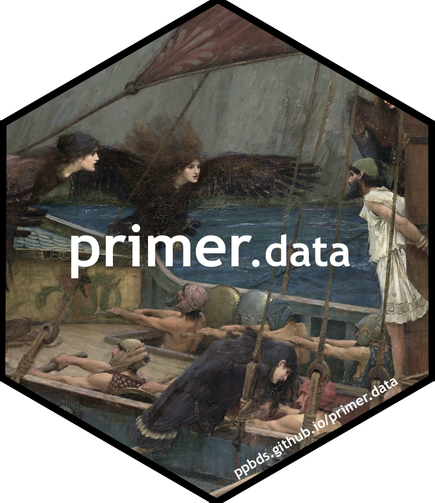
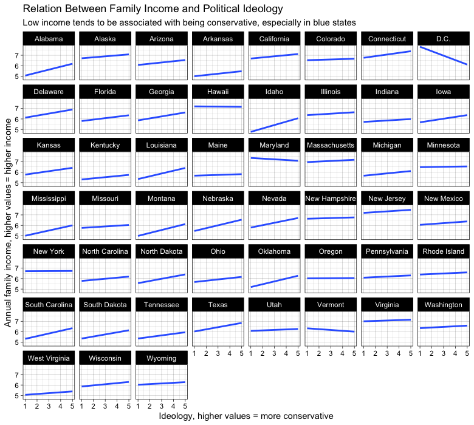

<!-- README is generated from README.Rmd, edit ONLY this file if needed. But, after you edit it, you NEED TO KNIT IT BY HAND in order to create the new README.md, which is the thing which is actually used. -->

# Data for *Preceptor’s Primer for <br/> Bayesian Data Science* 

<!-- badges: start -->

[](https://github.com/PPBDS/primer.data/actions)
<!-- badges: end -->

## About this package

`primer.data` provides the data used in *[Preceptor’s Primer for
Bayesian Data Science](https://ppbds.github.io/primer)* and for the
[associated tutorials](https://ppbds.github.io/primer.tutorials).

## Installation

``` r
remotes::install_github("ppbds/primer.data")
```

## Loading

After installing the package, it loads as any package should.

``` r
library(tidyverse) 
library(primer.data)

qscores
#> # A tibble: 748 × 9
#>    name       department number term   enrollment hours rating instructor female
#>    <chr>      <chr>      <chr>  <chr>       <int> <dbl>  <dbl> <chr>       <dbl>
#>  1 Introduct… AFRAMER    100Y   2019-…         49   2.6    4.2 Jesse McC…      0
#>  2 American … AFRAMER    123Z   2019-…         49   3.6    4.4 Cornel We…      0
#>  3 Urban Ine… AFRAMER    125X   2019-…         40   5.2    4.5 Elizabeth…      1
#>  4 Richard W… AFRAMER    130X   2019-…         23   7.2    4.4 Glenda Ca…      1
#>  5 19th cent… AFRAMER    131Y   2019-…         20   3.5    4.9 Linda Cha…      1
#>  6 Social Re… AFRAMER    199X   2019-…         19   7.2    4.8 Alejandro…      0
#>  7 Martin Lu… AFRAMER    199Y   2019-…         40   4.2    4.7 Brandon M…      0
#>  8 Elementar… AFRIKAAN   AB     2019-…         22   2.9    4.9 John M Mu…      0
#>  9 Elementar… JAMAICAN   AB     2019-…         18   1.5    4.9 John M Mu…      0
#> 10 Elementar… WSTAFRCN   AB     2019-…         29   2.6    4   John M Mu…      0
#> # … with 738 more rows
```

## Using the data

Once the library is loaded and you have confirmed that it can be
accessed in your local environment, the data sets can be called as
objects and used like any other data you would otherwise read in and
assign to an object manually. See the following example of a plot using
`primary.data::nobel`.

``` r
library(tidyverse)
library(primer.data)


ggplot(sub, aes(x = year, y = cum_prize, color = factor(born_country))) +
  geom_line() +
  scale_x_continuous(limits = c(1900, 2020),  expand = expand_scale(0, 1)) +
  labs(title = "Nobel Prizes Over Time by Origin of Laureate",
       y = "Prizes (Cumulative)",
       x = "Year",
       color = "Country") +
  theme_bw()
```

<!-- DK: We need some comments explaining what this is doing and how we can replace it. Specifically, why place the figure in man/ rather than inst/? Why can't we just have this code run and save/show the image? Hate the eval=FALSE above. -->



## Citing primer.data

``` r
citation("primer.data")
#> 
#> To cite 'primer.data' in publications use:
#> 
#>   Kane, D., & Weiss, T. (2021), 'primer.data'. R package version 0.1.0,
#>   <https://github.com/PPBDS/primer.data>.
#> 
#> A BibTeX entry for LaTeX users is
#> 
#>   @Manual{,
#>     title = {primer.data},
#>     author = {David Kane},
#>     author = {David Kane},
#>     year = {2021},
#>     url = {https://github.com/PPBDS/primer.data},
#>   }
```
